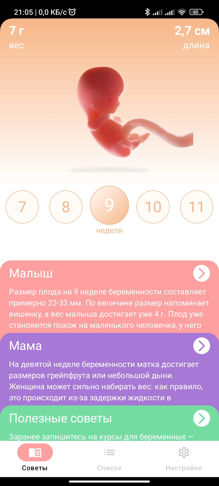
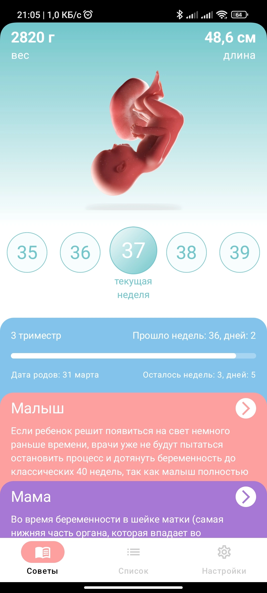
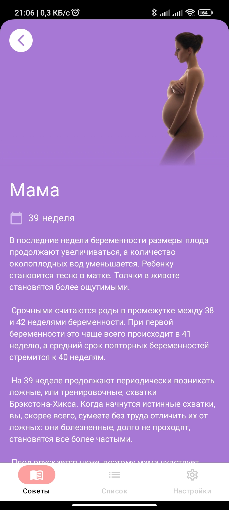
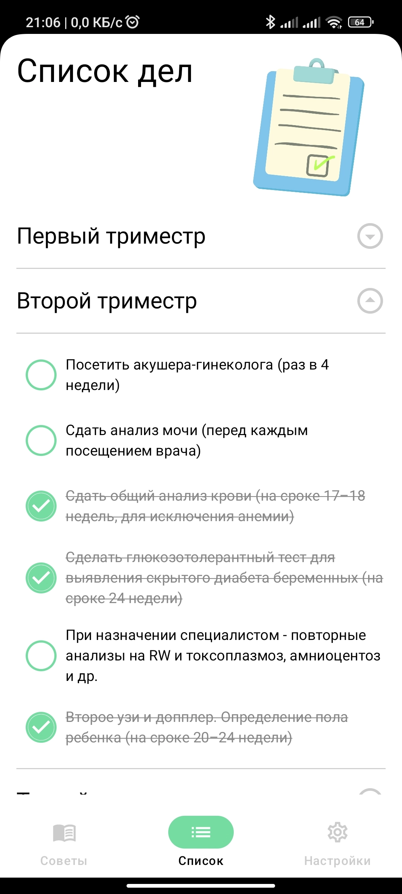

# CommonWeather
This is a pregnancy calendar app. Here you can get detailed information about the development of the child and the change in the female body during each week of pregnancy. 
And there is also a detailed to-do list for each stage of pregnancy. Completed tasks can be marked.

## Screenshots

## Technologies used 🛠:

- Clean architecture
- MVI pattern (MVIKotlin)
- Navigation with Decompose
- Modularization
- Jetpack Compose
- Dagger 2
- Coroutines
- Room
- SOLID

